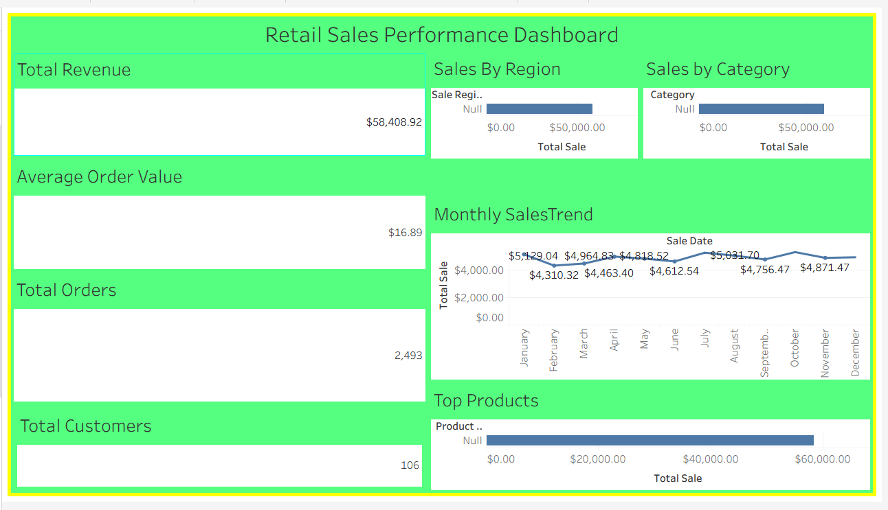

# Retail Sales Performance Dashboard

An interactive Tableau dashboard that analyzes retail sales performance across revenue, orders, customers, product categories, and regions. This project demonstrates end‑to‑end data modeling, KPI development, and visual analytics using a clean, business‑focused layout designed for executive decision‑making.

---

## 📊 Dashboard Preview

---

## 📁 Project Structure

tableau-retail-dashboard/
│
├── Tableau/
│   └── retail_sales_dashboard_final.twbx
│
├── data/
│   ├── calendar.csv
│   ├── customers.csv
│   ├── final_sales_model.csv
│   ├── products.csv
│   ├── regions.csv
│   └── sales.csv
│
├── images/
│   └── retail_sales_dashboard.png
│
└── README.md

---

## ✨ Key Features

### **1. Executive KPI Overview**
- Total Revenue  
- Average Order Value  
- Total Orders  
- Total Customers  

### **2. Sales Insights**
- Sales by Region  
- Sales by Category  
- Top Products  

### **3. Trend Analysis**
- Monthly Sales Trend showing seasonality and performance patterns  

---

## 🛠 Tools & Technologies
- Tableau Desktop  
- CSV‑based data model  
- Data modeling & relationships  
- Visual analytics & dashboard design  

---

## 📈 Skills Demonstrated
- KPI design and metric definition  
- Dashboard layout & UX best practices  
- Data cleaning and preprocessing  
- Trend and segmentation analysis  
- Visual storytelling for business insights  

---

## 🚀 How to Use
1. Download the `.twbx` file from the **Tableau** folder.  
2. Open it in Tableau Desktop.  
3. Interact with KPIs, charts, and filters to explore insights.

---

## 📬 Contact

**Portfolio:**  
https://niyonzansabandi-ai.github.io/portfolio/

**LinkedIn:**  
https://www.linkedin.com/in/nzansabandi-niyomugabo-5a28b7291

**Email:**  
niyonzansabandi@gmail.com
